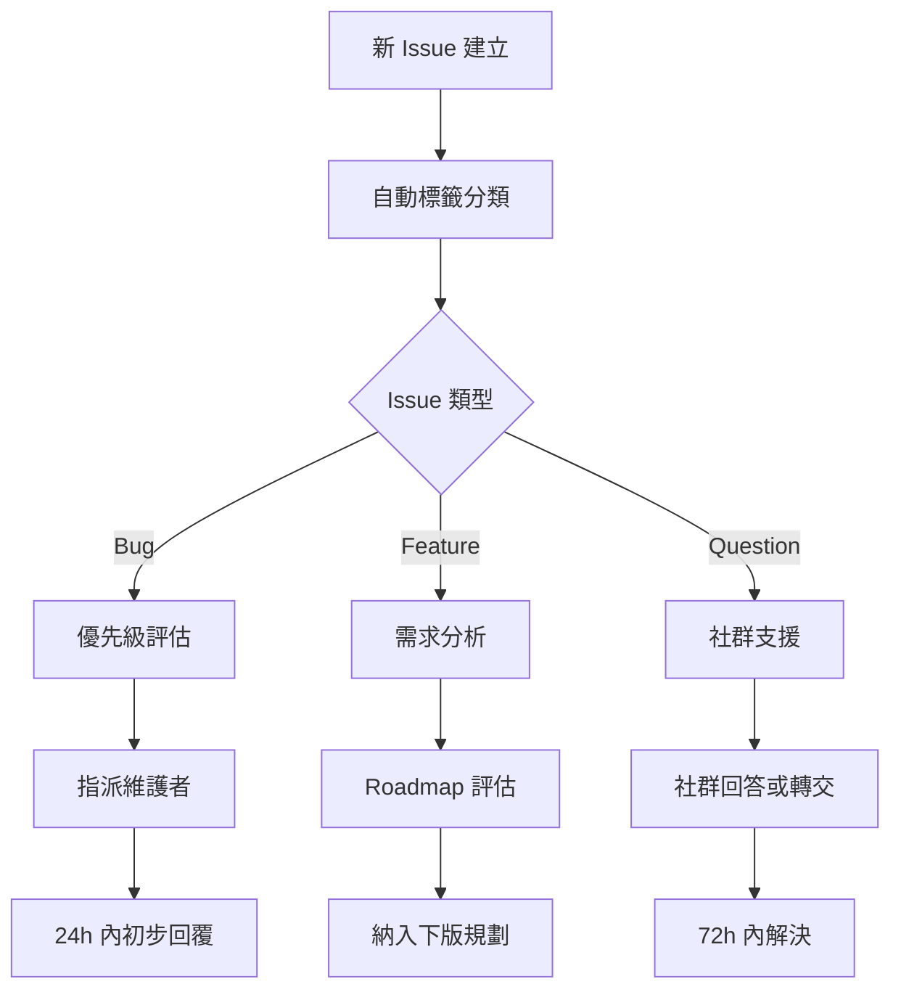

# Countdown Extension 社群維運計畫

## 概述

本文檔詳細說明 `countdown-extension` 專案的社群維運策略、流程和實施計畫，旨在建立一個活躍、健康的開源社群。

## 1. 社群維運策略

### 1.1 專案現況評估

**現有基礎設施：**
- ✅ 完整的 CI/CD 流程（[`ci.yml`](/.github/workflows/ci.yml)）
- ✅ 自動化發佈流程（[`release.yml`](/.github/workflows/release.yml)）
- ✅ Issue 模板系統（[`bug_report.yml`](/.github/ISSUE_TEMPLATE/bug_report.yml)、[`feature_request.yml`](/.github/ISSUE_TEMPLATE/feature_request.yml)）
- ✅ PR 模板（[`pull_request_template.md`](/.github/pull_request_template.md)）
- ✅ 依賴管理自動化（[`dependabot.yml`](/.github/dependabot.yml)）
- ✅ 貢獻指南（[`CONTRIBUTING.md`](/CONTRIBUTING.md)）
- ✅ 行為準則（[`CODE_OF_CONDUCT.md`](/CODE_OF_CONDUCT.md)）
- ✅ GitHub Discussions 已啟用

**團隊規模：** 1-2 位核心維護者

### 1.2 工作流程設計

#### Issue 分流機制


#### 回應時效標準
- **緊急 Bug**：4 小時內回覆，24 小時內修復或提供暫時解決方案
- **一般 Bug**：24 小時內回覆，7 天內修復
- **功能請求**：48 小時內回覆，納入下一版規劃討論
- **問題諮詢**：24 小時內回覆，3 天內完整解答

### 1.3 貢獻者引導流程

#### 新手任務清單
1. **Good First Issue** 標籤的任務
   - 文檔翻譯和改進
   - 簡單的 UI 調整
   - 測試案例補充
   - 範例代碼撰寫

2. **Mentor 配對機制**
   - 每位新貢獻者配對一位經驗豐富的維護者
   - 定期檢查進度並提供指導
   - 確保第一次 PR 能順利合併

## 2. 自動化工具配置

### 2.1 GitHub Bot 設定

#### Stale Bot 配置
自動管理閒置的 Issues 和 PRs：

```yaml
# .github/workflows/stale.yml
name: 'Close stale issues and PRs'
on:
  schedule:
    - cron: '30 1 * * *'

jobs:
  stale:
    runs-on: ubuntu-latest
    steps:
    - uses: actions/stale@v8
      with:
        stale-issue-message: '此 Issue 已超過 60 天沒有活動。如果仍然相關，請留言說明；否則將在 7 天後自動關閉。'
        stale-pr-message: '此 PR 已超過 30 天沒有活動。請更新或說明狀態；否則將在 7 天後自動關閉。'
        close-issue-message: '由於長期沒有活動，此 Issue 已自動關閉。如需重新開啟，請留言說明。'
        close-pr-message: '由於長期沒有活動，此 PR 已自動關閉。如需繼續，請重新開啟並更新。'
        days-before-stale: 60
        days-before-close: 7
        stale-issue-label: 'stale'
        stale-pr-label: 'stale'
        exempt-issue-labels: 'pinned,security,enhancement'
        exempt-pr-labels: 'pinned,security'
```

#### 自動標籤機器人
根據 Issue 內容自動添加標籤：

```yaml
# .github/workflows/label.yml
name: 'Auto Label'
on:
  issues:
    types: [opened]
  pull_request:
    types: [opened]

jobs:
  auto-label:
    runs-on: ubuntu-latest
    steps:
    - uses: actions/labeler@v4
      with:
        repo-token: '${{ secrets.GITHUB_TOKEN }}'
        configuration-path: '.github/labeler.yml'
```

### 2.2 社群健康度監控

#### 月報自動生成
```yaml
# .github/workflows/community-metrics.yml
name: 'Community Metrics'
on:
  schedule:
    - cron: '0 0 1 * *'  # 每月1號執行
  workflow_dispatch:

jobs:
  metrics:
    runs-on: ubuntu-latest
    steps:
    - uses: actions/checkout@v3
    - name: Generate Community Report
      uses: github/contributor-metrics@v1
      env:
        GITHUB_TOKEN: ${{ secrets.GITHUB_TOKEN }}
      with:
        report-path: 'community-metrics.md'
```

## 3. 長期發展規劃

### 3.1 版本發佈週期

- **Patch 版本**：每 2 週（錯誤修復）
- **Minor 版本**：每月（新功能）
- **Major 版本**：每季（重大更新）

### 3.2 Roadmap 管理

使用 GitHub Projects 進行規劃：
- **當前版本**：正在開發的功能
- **下一版本**：已確認的功能需求
- **Future**：社群建議和長期規劃

### 3.3 用戶反饋收集

#### 季度用戶調查
- 使用體驗調查
- 功能需求收集
- 滿意度評估

#### GitHub Discussions 分類
- **💡 Ideas**：功能建議討論
- **🙏 Q&A**：使用問題解答
- **📢 Announcements**：重要公告
- **💬 General**：一般討論

## 4. 社群成長指標

### 4.1 核心指標

| 指標 | 目標值 | 監控頻率 |
|------|--------|----------|
| Issue 回應時間 | < 24h | 每週 |
| PR 處理時間 | < 7 天 | 每週 |
| 新貢獻者數量 | 2+ / 月 | 每月 |
| 活躍用戶數 | 增長 10% / 季 | 每季 |
| 文檔完整度 | > 90% | 每月 |

### 4.2 健康度評估

#### 每月評估項目
- [ ] Issue 積壓數量
- [ ] PR 審查時效
- [ ] 社群互動活躍度
- [ ] 新貢獻者轉換率
- [ ] 用戶滿意度

## 5. 啟動時程表

### 第一週：文檔和模板更新
- [x] 更新 [`CONTRIBUTING.md`](/CONTRIBUTING.md) 增加新手指南
- [x] 完善 Issue 和 PR 模板
- [ ] 建立 Good First Issue 清單
- [ ] 撰寫 Mentor 指南

### 第二週：自動化部署
- [ ] 部署 Stale Bot
- [ ] 設定自動標籤系統
- [ ] 配置社群健康度監控
- [ ] 啟用 GitHub Discussions

### 第三週：社群推廣
- [ ] 發佈社群公告
- [ ] 招募第一批 Mentors
- [ ] 建立社群參與指南
- [ ] 開始定期月報

### 持續進行：維運和優化
- [ ] 每週檢查 Issue/PR 狀態
- [ ] 每月發佈社群報告
- [ ] 每季評估和調整策略

## 6. 團隊分工

### 維護者 A
- Issue 分流和優先級設定
- 社群公告和溝通
- 新貢獻者引導
- 月報撰寫

### 維護者 B
- 代碼審查和技術支援
- 自動化工具維護
- 發佈管理
- 文檔技術更新

## 7. 成功指標

### 短期目標（3 個月）
- [ ] 建立完整的自動化流程
- [ ] 招募 3-5 位活躍貢獻者
- [ ] 達成 < 24h Issue 回應時間
- [ ] 發佈 2 個社群驅動的功能

### 中期目標（6 個月）
- [ ] 建立穩定的貢獻者社群（10+ 人）
- [ ] 實現自治化的 Issue 分流
- [ ] 達成 90%+ 的用戶滿意度
- [ ] 建立成熟的 Mentor 計畫

### 長期目標（12 個月）
- [ ] 成為 VSCode 生態中的知名擴展
- [ ] 建立產業影響力
- [ ] 培養下一代維護者
- [ ] 建立可持續的開發模式

---

**文檔版本**：1.0  
**最後更新**：2025年6月6日  
**下次審查**：2025年7月6日

如有任何問題或建議，請在 [GitHub Discussions](https://github.com/vscode-countdown-dev/countdown-extension/discussions) 中討論。