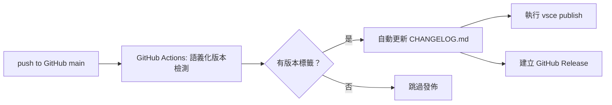
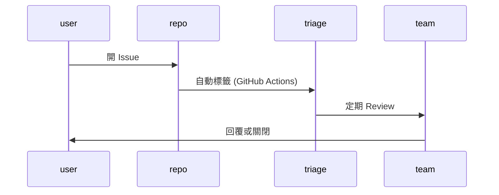
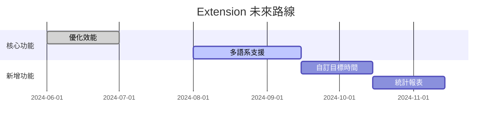
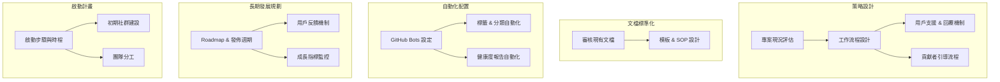

# 第四階段：上架與維運策略

## 1. VS Code Marketplace 發佈指導

### 步驟與操作

1. **註冊 Publisher 帳號**  
   1. 前往 https://marketplace.visualstudio.com/manage 註冊或登入 Microsoft 帳號  
   2. 建立新的 Publisher，填寫「發佈者名稱」與「公司資訊」  
2. **設定 `vsce`**

    ```bash
    npm install -g vsce
    vsce login <publisher-name>
    ```
3. **準備發佈**

    - 確認 [`package.json`](countdown-extension/package.json:1) 中 `publisher` 欄位正確  
    - 更新 [`README.md`](countdown-extension/README.md:1) 與 [`CHANGELOG.md`](countdown-extension/CHANGELOG.md:1)  
4. **執行發佈**

    ```bash
    vsce package
    vsce publish [patch|minor|major] --pre-release?
    ```
5. **檢查清單 (QA)**

    - ✅ `version` 與 CHANGELOG 對應  
    - ✅ Icon 與 README 圖片可正常顯示  
    - ✅ Marketplace 試裝測試無錯誤  
    - ✅ Release Notes 已更新於 [`RELEASE_NOTES.md`](countdown-extension/RELEASE_NOTES.md:1)

---

## 2. 版本自動化發佈流程



### 核心策略

1. **語義化版本與標籤**  
   - commit message 採用 Conventional Commits  
   - Actions 自動偵測 `feat|fix|chore` 生成 `vX.Y.Z` 標籤  
2. **自動化 CHANGELOG**  
   - 使用 [release-drafter/release-drafter](https://github.com/release-drafter/release-drafter)  
   - 範本放置於 `.github/release-drafter.yml`  
3. **CI 設定**

    ```yaml
    name: Release
    on:
      push:
        tags:
          - 'v*.*.*'
    jobs:
      publish:
        runs-on: ubuntu-latest
        steps:
          - uses: actions/checkout@v3
          - uses: actions/setup-node@v3
            with: node-version: '18'
          - run: npm ci
          - run: npm run build
          - run: npx vsce publish --pat ${{ secrets.VSCE_TOKEN }}
    ```
---
## 3. 使用者回饋收集機制

### Issues 模板與標籤

- 在 `.github/ISSUE_TEMPLATE/bug.yml` 與 `.github/ISSUE_TEMPLATE/feature_request.yml` 中定義表單  
- 標籤系統：`bug`、`enhancement`、`question`、`help wanted`

### 反饋流程



### 社群互動

- 定期在 README 中加入「貢獻指南」([`CONTRIBUTING.md`](countdown-extension/CONTRIBUTING.md:1))  
- 設置「每月回顧」Issue，邀請用戶提供改進意見

---

## 4. 維護與功能擴展計劃

### 長期維護策略

- **釋出週期**：小改動 (minor/patch) 每週；大功能 (major) 每季  
- **支援版本**：Node.js LTS、VS Code 後三個主要版本  

### 路線圖與功能擴展



### 倉庫治理

- 定期執行 `npm audit` 和 Dependabot 自動更新  
- 設立貢獻者守則及審核流程 ([`CODE_OF_CONDUCT.md`](countdown-extension/CODE_OF_CONDUCT.md:1))

---

# 完成

本文檔已完成 VS Code Marketplace 上架與維運策略規劃。
## 5. 社群維運啟動計畫

### 整體流程圖


### 時程與分工
| 步驟                   | 時程   | 負責人       |
|----------------------|-------|------------|
| 更新文檔範本               | 第1週  | 維護者 A     |
| 部署自動化機器人             | 第2週  | 維護者 B     |
| 啟用 GitHub Discussions 社區 | 第2週  | 維護者 A     |
| 發佈社群公告 & 招募 mentor    | 第3週  | 維護者 A/B   |
| 每月例會與報告發佈           | 持續進行 | 維護者 A/B   |

**完成**：社群維運啟動計畫已編寫並準備實施。