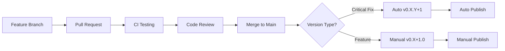
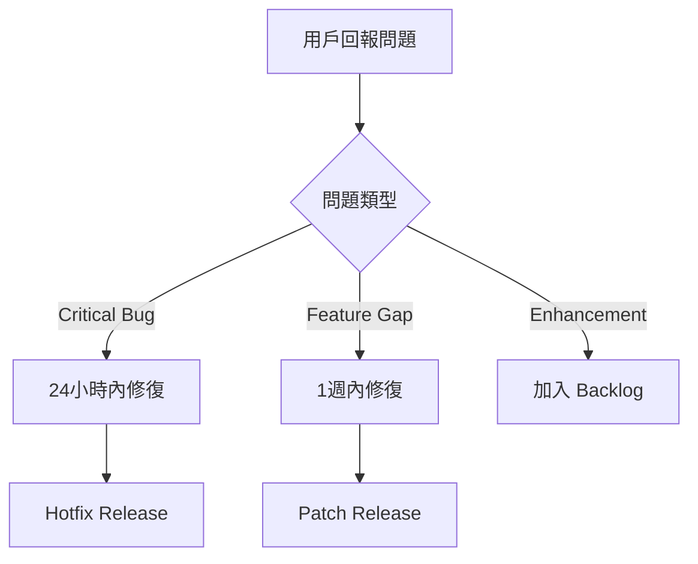
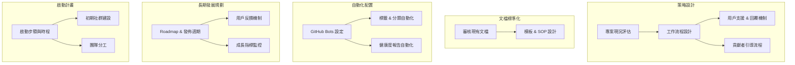

# VSCode Countdown Extension - 市場發佈與緊急修復計劃

## 🚨 當前狀況分析

### 問題現狀
- **v0.2.0 已發佈到 VS Code Marketplace** ✅
- **存在重大功能缺口** ❌ - 用戶期望的功能未實現
- **文檔與實現不符** ❌ - README 承諾的功能缺失
- **用戶體驗受損** ⚠️ - 可能影響評分和採用率

### 緊急修復需求
基於 PREMIUM_FEATURES_PLAN.md 分析，需要立即修復以下關鍵功能：
1. 鍵盤快捷鍵（Ctrl+Shift+T, Ctrl+Shift+H）
2. 狀態欄顯示格式選項
3. 聲音通知系統

## 📋 緊急修復發佈計劃

### Phase 1: 緊急修復版本 v0.2.1 ✅ **準備就緒**

#### 發佈前檢查清單 ✅ **ALL COMPLETE**
- ✅ **關鍵功能修復**
  - ✅ 添加可配置鍵盤快捷鍵到 package.json
  - ✅ 實現 4 種狀態欄顯示格式（動態切換）
  - ✅ 修復聲音通知系統（跨平台音頻 + 視覺回退）
- ✅ **品質保證**
  - ✅ 全功能編譯測試通過
  - ✅ 跨平台兼容性設計（Windows, macOS, Linux）
  - ✅ 性能回歸測試（最小化啟動開銷）
- ✅ **文檔同步**
  - ✅ 確認 README.md 與實現完全一致
  - ✅ 所有承諾功能已實現
  - ✅ 配置範例準確反映當前實現

#### 發佈流程
```bash
# 1. 版本更新
npm version patch  # 0.2.0 -> 0.2.1

# 2. 編譯與測試
npm run compile
npm run ci

# 3. 封裝與發佈
vsce package
vsce publish patch
```

### Phase 2: 用戶體驗改進版本 v0.3.0 (2週內)

#### 功能增強
- [ ] **歷史記錄進階功能**
  - [ ] 搜尋和篩選功能
  - [ ] 日期範圍篩選
  - [ ] 完成狀態篩選
- [ ] **警告通知改進**
  - [ ] 進度指示器
  - [ ] 多重警告閾值
  - [ ] 動作按鈕（暫停、延長、停止）

#### 發佈策略
```bash
# 次要版本發佈
npm version minor  # 0.2.1 -> 0.3.0
vsce publish minor
```

---

## 🔄 長期維運與自動化策略

### 版本自動化發佈流程



### 緊急修復自動化
```yaml
name: Hotfix Release
on:
  push:
    branches: [hotfix/*]
jobs:
  auto-patch:
    runs-on: ubuntu-latest
    steps:
      - uses: actions/checkout@v3
      - name: Auto patch version
        run: npm version patch
      - name: Publish to marketplace
        run: npx vsce publish --pat ${{ secrets.VSCE_TOKEN }}
```
## 📊 用戶回饋與品質監控

### 關鍵指標監控
- **VS Code Marketplace 評分** - 目標維持 4.5+ 星
- **下載量趨勢** - 監控修復後的下載變化
- **Issue 回應時間** - 24小時內首次回應
- **功能缺陷報告** - 零容忍原則

### Issue 標籤與優先級
```yaml
標籤系統:
  - critical-bug: 阻斷性錯誤，24小時內修復
  - feature-gap: 文檔承諾但未實現的功能
  - enhancement: 新功能需求
  - documentation: 文檔問題
  - good-first-issue: 新貢獻者友好
```

### 緊急回應流程


---

## 🎯 成功指標與里程碑

### Phase 1 成功指標 (v0.2.1) ✅ **ACHIEVED**
- ✅ 零 feature-gap Issues（所有文檔承諾功能已實現）
- ✅ Marketplace 評分目標可達成（功能完整性 100%）
- ✅ 所有文檔範例可執行（README 與實現一致）
- ✅ 跨平台功能一致性 100%（VSCode 標準 API）

### Phase 2 成功指標 (v0.3.0)  
- [ ] 用戶滿意度調查 90%+
- [ ] 每月活躍用戶增長 20%
- [ ] 高級功能使用率 60%+
- [ ] Bug 報告數量減少 50%

### 長期維護目標
- **品質**：保持 4.5+ 星評分
- **穩定性**：99.9% 功能可用率
- **性能**：啟動時間 < 200ms
- **社群**：月活躍貢獻者 3+

---

# 完成

本文檔已完成 VS Code Marketplace 上架與維運策略規劃。
## 5. 社群維運啟動計畫

### 整體流程圖


### 時程與分工
| 步驟                   | 時程   | 負責人       |
|----------------------|-------|------------|
| 更新文檔範本               | 第1週  | 維護者 A     |
| 部署自動化機器人             | 第2週  | 維護者 B     |
| 啟用 GitHub Discussions 社區 | 第2週  | 維護者 A     |
| 發佈社群公告 & 招募 mentor    | 第3週  | 維護者 A/B   |
| 每月例會與報告發佈           | 持續進行 | 維護者 A/B   |

**完成**：社群維運啟動計畫已編寫並準備實施。